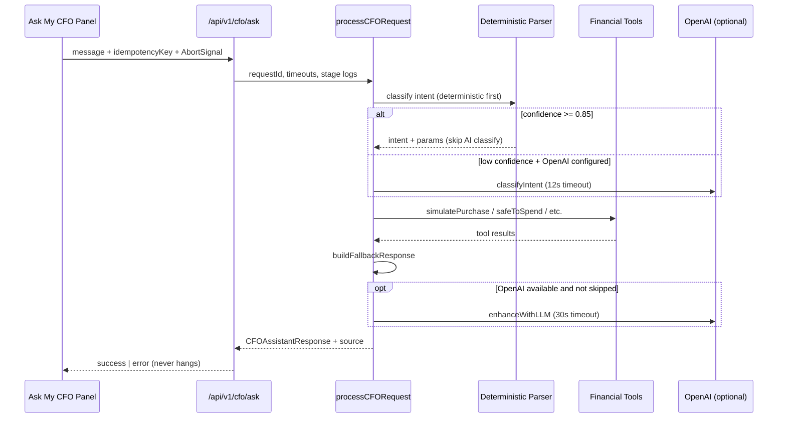

# Ask My CFO Request Pipeline

## Overview

Ask My CFO is Finance King's conversational advisor. Every user question flows through a hardened pipeline that **always terminates** in one of three outcomes:

1. AI-enhanced answer (numbers from Finance King, prose from AI)
2. Deterministic fallback (numbers and prose from Finance King tools)
3. Clear recoverable error

## Entry Points

| Layer | Path |
|-------|------|
| Client | `src/components/cfo/ask-my-cfo-panel.tsx` |
| Client hook | `src/components/cfo/use-cfo-request.ts` |
| Primary API | `POST /api/v1/cfo/ask` |
| Alias API | `POST /api/cfo/ask` |
| Legacy API | `POST /api/v1/cfo/conversations` |

## Request Lifecycle



## Core Modules

| Module | Responsibility |
|--------|----------------|
| `pipeline/process-request.ts` | Orchestrates full request with timeouts |
| `pipeline/deterministic-parse.ts` | Regex intent parsing before AI |
| `pipeline/timeout.ts` | `withTimeout` helper |
| `pipeline/fallback.ts` | Deterministic fallback builder |
| `pipeline/error-map.ts` | User-safe error messages |
| `pipeline/idempotency.ts` | Duplicate submission guard |
| `pipeline/stages.ts` | Structured stage logging |
| `tools/simulateBusinessPurchase` | Business affordability without AI |

## Architectural Rule

**Finance King performs the math. AI explains the math.**

All balances, safe-to-spend, forecasts, and affordability verdicts come from `src/lib/engine/` and `src/lib/financial-state/`. OpenAI never calculates numbers.

## Response Contract

```ts
type CFOAskResponse =
  | { success: true; requestId; source: "AI" | "DETERMINISTIC_FALLBACK"; answer: CFOAssistantResponse }
  | { success: false; requestId; error: { category; message; retryable } };
```

## Streaming

Not used. JSON request/response only for reliability on Render.
