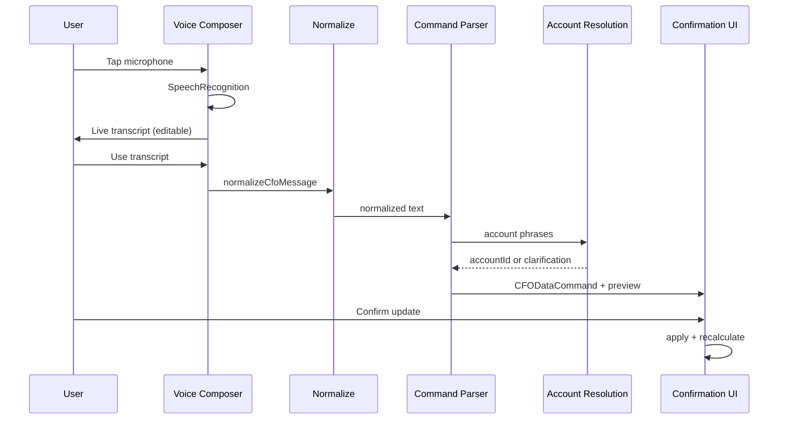

# Voice CFO Architecture

## Overview

Ask My CFO supports natural speech input and casual account references. Voice transcribes to text; the same parse → preview → confirm pipeline applies. Financial mutations never run from transcription alone.

## Components

| Layer | Path | Role |
|-------|------|------|
| Voice hook | `src/lib/voice/use-voice-input.ts` | Browser STT, state machine |
| STT provider | `src/lib/voice/browser-speech-provider.ts` | `SpeechRecognition` abstraction |
| Composer | `src/components/cfo/cfo-voice-composer.tsx` | Mic, transcript, send |
| NLP | `src/lib/nlp/` | Spoken numbers, dates, normalization |
| Account resolution | `src/lib/accounts/` | Aliases, scoring, clarification |
| Command parser | `src/lib/ai/commands/parser.ts` | Uses normalized text + resolution |
| Aliases API | `src/app/api/v1/account-aliases/` | CRUD + learned aliases |

## Flow

## Browser support

- Chrome / Edge: `webkitSpeechRecognition`
- Safari iOS: `webkitSpeechRecognition` (limited)
- Fallback: typing only; mic hidden when unsupported

## Security

- Microphone allowed via Permissions-Policy on dashboard routes
- No raw audio stored by default
- Transcript stored only in CFO conversation when sent
- Auth required for all voice-backed API calls
