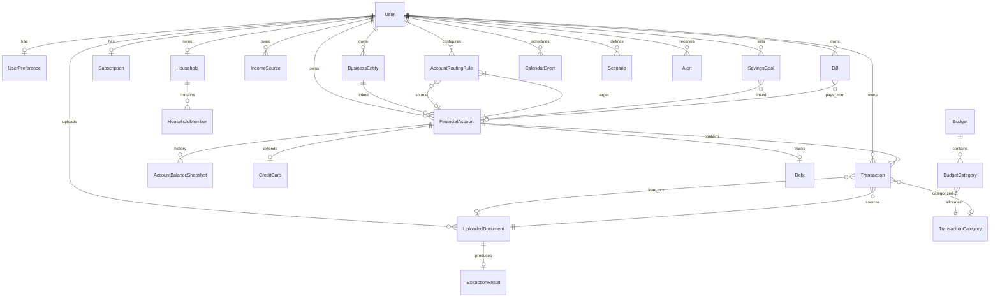

# Finance King — Database Schema

**ORM:** Prisma 6  
**Database:** PostgreSQL 16  
**Source of truth:** `prisma/schema.prisma`

---

## 1. ERD Narrative

Finance King models a **single-user tenancy** with rich financial entities. Every financial table carries a `userId` foreign key for tenant isolation. The schema groups into eight domains:

### 1.1 Auth & Tenancy

The `User` is the root entity. One user owns one `Household`, many `BusinessEntity` records, and all financial data.

```
User (1) ──── (1) UserPreference
     │
     ├── (1) Household ──── (*) HouseholdMember
     ├── (1) Subscription
     ├── (*) UserConsent
     ├── (*) Account [NextAuth OAuth — not FinancialAccount]
     └── (*) Session
```

**User** stores identity (`email`, `passwordHash`, `name`), role (`USER | ADMIN | ADVISOR`), plan tier (`FREE | KING | EMPIRE`), feature flags (JSON), and onboarding state.

**UserPreference** holds engine inputs: `safetyMarginFlat` (default $500), `safetyMarginPercent`, theme, timezone, notification toggles, and privacy settings (`localOcrOnly`, `autoDeleteUploadDays`).

### 1.2 Financial Accounts

The heart of the data model. `FinancialAccount` represents a real-world account at an institution.

```
User (1) ──── (*) FinancialAccount
                      │
                      ├── (0..1) BusinessEntity
                      ├── (*) AccountBalanceSnapshot
                      ├── (0..1) CreditCard
                      ├── (0..1) Debt
                      ├── (*) Transaction
                      └── (*) RecurringTransaction

AccountRoutingRule:
  User ──► sourceAccount? ──► targetAccount (required)
```

**Key fields on FinancialAccount:**

| Field | Purpose |
|-------|---------|
| `institution` | Bank name (PenFed, Truist, etc.) |
| `nickname` | Display name |
| `accountType` | CHECKING, SAVINGS, CREDIT_CARD, TAX_RESERVE, etc. |
| `routingTag` | PERSONAL, JADESYSTEMS, PACIFIC_LUXE, NY_PROPERTY, TAX_RESERVE, EMERGENCY |
| `currentBalance` | Latest known balance |
| `minimumTargetBalance` | Floor the engine enforces (e.g., $10k PenFed checking) |
| `protectedBalance` | Amount that cannot be spent (e.g., $40k emergency savings) |
| `isLiquid` | Whether included in liquid cash calculation |
| `isSeedData` | Marks demo/seed records |

**AccountBalanceSnapshot** provides point-in-time balance history with source tracking (MANUAL, OCR, IMPORT, SEED).

**AccountRoutingRule** defines income allocation:

| Field | Example |
|-------|---------|
| `incomeSourceKey` | `contract` |
| `targetAccountId` | Truist Tax Reserve |
| `allocationPercent` | 35 |

### 1.3 Transactions & Categories

```
User (1) ──── (*) TransactionCategory (tree via parentId)
     │
     ├── (*) CategorizationRule (pattern → category)
     └── (*) Transaction
              │
              ├── FinancialAccount
              ├── TransactionCategory?
              └── UploadedDocument? (if OCR-sourced)
```

**Transaction** captures individual line items:

- `type`: INCOME, EXPENSE, TRANSFER, DEBT_PAYMENT, SAVINGS
- `isTransfer` + `transferPairId` for linked transfer pairs
- `confidence` for OCR-extracted transactions
- `documentId` links back to source upload

**CategorizationRule** provides auto-categorization via regex patterns with priority ordering.

### 1.4 Ingestion (OCR Pipeline)

```
User (1) ──── (*) UploadedDocument
                      │
                      └── (1) ExtractionResult
                               │
                               └── JSON: extractedData, fieldConfidence
```

**UploadedDocument** lifecycle:

```
PENDING → PROCESSING → REVIEW_REQUIRED → CONFIRMED
                    ↘ REJECTED
                    ↘ DUPLICATE (unique on userId + fileHash)
```

Fields: `fileHash` (dedup), `storageKey` (S3 path), `encryptionIv`, `institution`, `documentType`.

**ExtractionResult** stores raw OCR text and structured JSON with per-field confidence scores.

### 1.5 Recurring, Income & Bills

```
User (1) ──── (*) IncomeSource
     │              routingTag, isProvisional, frequency
     │
     ├── (*) Bill
     │        dueDay, nextDueDate, isRequired
     │
     └── (*) RecurringTransaction
              classification: NECESSARY | DISCRETIONARY | POTENTIALLY_REDUCIBLE
              status: DETECTED → APPROVED | REJECTED | EDITED
```

**IncomeSource** drives cash flow projections:

| Status | Meaning |
|--------|---------|
| SCHEDULED | Expected but not received |
| RECEIVED | Confirmed deposit |
| CANCELLED | Will not occur |

`isProvisional: true` marks uncertain income (e.g., Diminished Value $4k) — engine flags safe-to-spend as provisional.

**Bill** represents fixed obligations. `isRequired: true` bills are subtracted in safe-to-spend. `dueDay` (1–31) used when `nextDueDate` is null.

### 1.6 Debt & Credit

```
FinancialAccount (CREDIT_CARD) ──► CreditCard
                               ──► Debt

User (1) ──── (*) CreditScoreSnapshot
     └── (*) CreditGoal
```

**CreditCard** extends account with issuer-specific fields: APR, promotional rate, statement close day, account age.

**Debt** tracks payoff targets (`targetPayoffDate`) separate from minimum payments.

For the seed user, Amex is modeled as both a `FinancialAccount` (CREDIT_CARD), `CreditCard` record, and `Debt` record.

### 1.7 Goals & Budgets

```
User (1) ──── (*) SavingsGoal
     │              type: EMERGENCY_FUND | TAX_RESERVE | DEBT_FREE | CREDIT_SCORE | CUSTOM
     │              isProtected: prevents spending from linked account
     │
     └── (*) Budget ──── (*) BudgetCategory
                              └── TransactionCategory
```

**SavingsGoal** links to a `FinancialAccount` and feeds the protected reserves calculation:

- Emergency: PenFed Premium Online Savings ($40k target, protected)
- Tax Reserve: Truist Tax Reserve ($30k target)
- Personal Operating Cash: PenFed Checking ($10k target)

### 1.8 Planning, Alerts & Audit

```
User (1) ──── (*) CalendarEvent
     │              type: BILL | PAYDAY | DEBT_PAYMENT | CREDIT_DUE | etc.
     │
     ├── (*) CashFlowProjection (scenarioType + date → JSON data)
     ├── (*) Scenario (CONSERVATIVE | BASE | STRONG + parameters JSON)
     ├── (*) PlannedPurchase
     ├── (*) TripBudget
     ├── (*) Alert (type + severity + metadata JSON)
     ├── (*) Recommendation (priority + actionUrl)
     └── (*) AuditLog (action + entityType + metadata)
```

**CalendarEvent** is the unified scheduling model. Amex payoff payments are stored as `DEBT_PAYMENT` events with amounts and source accounts.

**Scenario** stores parameter overrides:

```json
{
  "incomeMultiplier": 1.0,
  "expenseMultiplier": 1.0,
  "includeEsop": true,
  "esopAmount": 105000
}
```

---

## 2. Entity Relationship Diagram (Mermaid)



---

## 3. Enum Reference

### Account & Routing

| Enum | Values |
|------|--------|
| `AccountType` | CHECKING, SAVINGS, MONEY_MARKET, BUSINESS_CHECKING, BUSINESS_SAVINGS, JOINT_CHECKING, JOINT_SAVINGS, CREDIT_CARD, VEHICLE_LOAN, MORTGAGE, PERSONAL_LOAN, RETIREMENT, INVESTMENT, PROPERTY, BUSINESS_ENTITY, TAX_RESERVE |
| `RoutingTag` | PERSONAL, JADESYSTEMS, PACIFIC_LUXE, NY_PROPERTY, TAX_RESERVE, EMERGENCY |
| `OwnershipType` | INDIVIDUAL, JOINT, BUSINESS |
| `Designation` | PERSONAL, BUSINESS |

### Cash Flow

| Enum | Values |
|------|--------|
| `TransactionType` | INCOME, EXPENSE, TRANSFER, DEBT_PAYMENT, SAVINGS |
| `IncomeStatus` | SCHEDULED, RECEIVED, CANCELLED |
| `IncomeFrequency` | ONE_TIME, WEEKLY, BIWEEKLY, SEMIMONTHLY, MONTHLY, QUARTERLY, ANNUAL |
| `BillFrequency` | ONE_TIME, WEEKLY, BIWEEKLY, MONTHLY, QUARTERLY, ANNUAL |

### Ingestion

| Enum | Values |
|------|--------|
| `UploadStatus` | PENDING, PROCESSING, REVIEW_REQUIRED, CONFIRMED, REJECTED, DUPLICATE |
| `ExtractionStatus` | PENDING, COMPLETE, FAILED |
| `BalanceSource` | MANUAL, OCR, IMPORT, SEED |

### Planning & Risk

| Enum | Values |
|------|--------|
| `ScenarioType` | CONSERVATIVE, BASE, STRONG |
| `RiskLevel` | GREEN, YELLOW, ORANGE, RED |
| `AlertSeverity` | INFO, WARNING, URGENT, CRITICAL |
| `CalendarEventType` | BILL, PAYDAY, INCOME, CREDIT_DUE, STATEMENT_CLOSE, TRAVEL, PURCHASE, DEBT_PAYMENT, TRANSFER, SAVINGS |

---

## 4. Indexes & Constraints

| Table | Index/Constraint | Purpose |
|-------|------------------|---------|
| `FinancialAccount` | `[userId, accountType]` | Fast account listing by type |
| `Transaction` | `[userId, date]`, `[accountId, date]` | Transaction history queries |
| `UploadedDocument` | `@@unique([userId, fileHash])` | Duplicate upload prevention |
| `UploadedDocument` | `[userId, status]` | Review queue filtering |
| `CalendarEvent` | `[userId, date]` | Calendar month views |
| `CashFlowProjection` | `@@unique([userId, scenarioType, date])` | One projection per scenario per day |
| `AuditLog` | `[userId, createdAt]` | Audit trail pagination |
| `Alert` | `[userId, isRead]` | Unread alert queries |

---

## 5. Seed Data Mapping

The seed script (`prisma/seed.ts`) populates Timothy's profile:

| Entity | Count | Notes |
|--------|-------|-------|
| User | 1 | `tim@financeking.local` |
| FinancialAccount | 11 | All institutions |
| AccountRoutingRule | 5 | Income routing |
| IncomeSource | ~40 | Jul–Dec schedule |
| Bill | 6 | ~$26,100/month fixed |
| SavingsGoal | 3 | Emergency, tax, operating |
| CalendarEvent | 4 | Amex payoff schedule |
| PlannedPurchase | 5 | Car Week, trips, wrap |
| RecurringTransaction | 4 | Detected patterns |
| Scenario | 3 | Conservative/Base/Strong |
| CreditCard + Debt | 1 each | Amex |
| Alert + Recommendation | 1 each | Amex funding warning |

All seed records have `isSeedData: true` for easy cleanup.

---

## 6. Migration Strategy

```bash
# Development
npm run db:migrate     # prisma migrate dev

# Production (Vercel build)
npm run build          # includes prisma generate
# Run migrations separately:
npx prisma migrate deploy
```

Neon pooled connections: always use the `-pooler` hostname in `DATABASE_URL` for serverless environments.

---

## 7. Related Documents

- [Architecture](./architecture.md) — System layers and data flow
- [Seed Data Plan](./seed-data-plan.md) — Detailed seed profile
- [Cash Flow Rules](./cash-flow-rules.md) — How income and bills interact with schema
- [OCR Ingestion](./ocr-ingestion.md) — Upload document lifecycle
