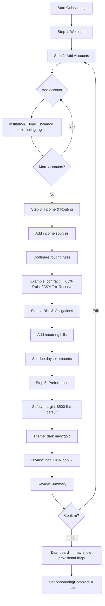
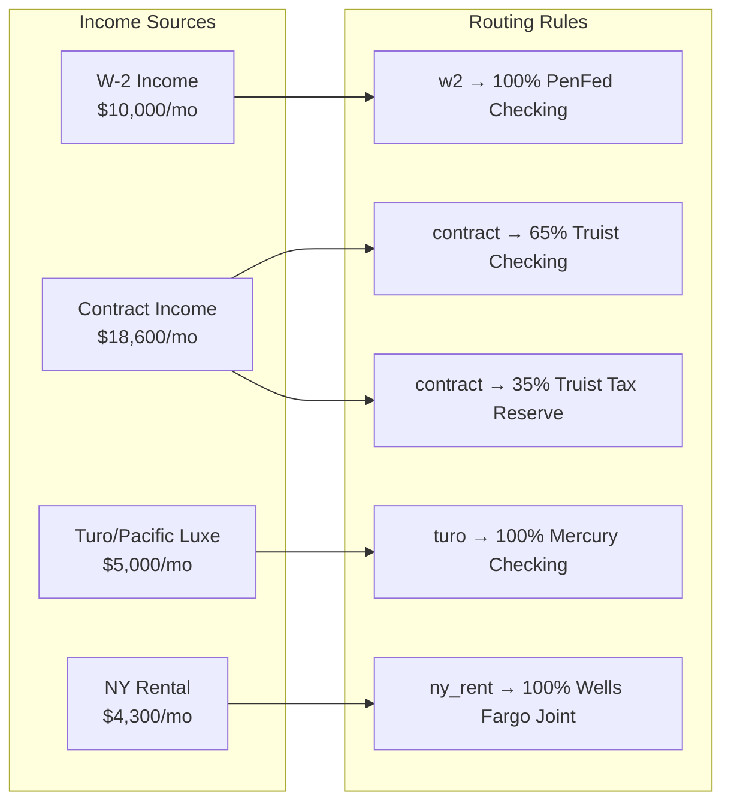
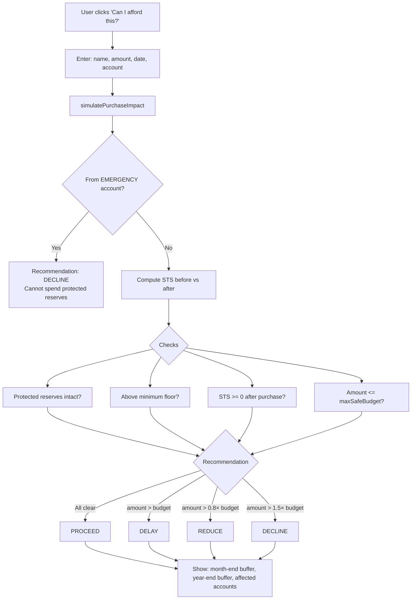
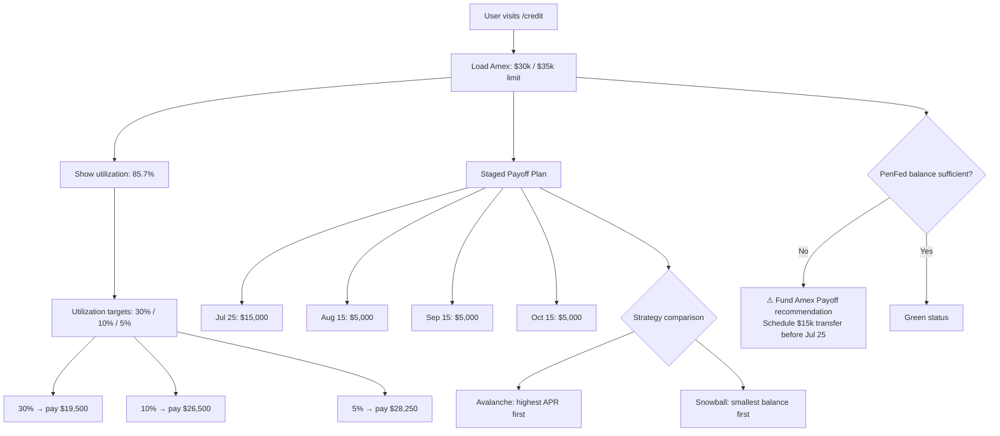
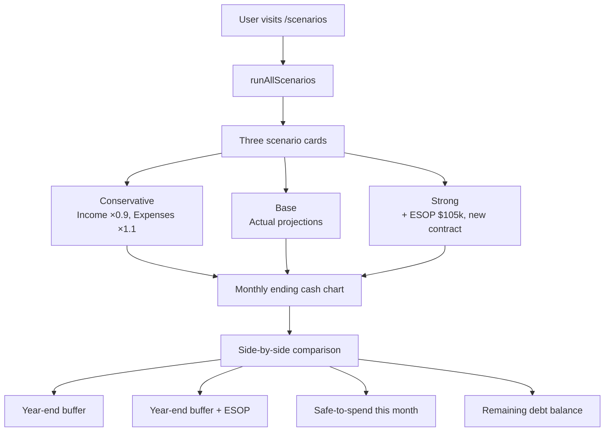
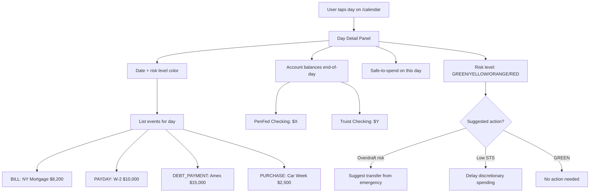
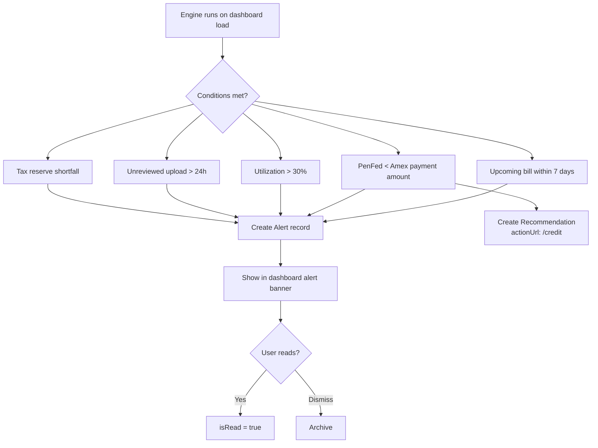
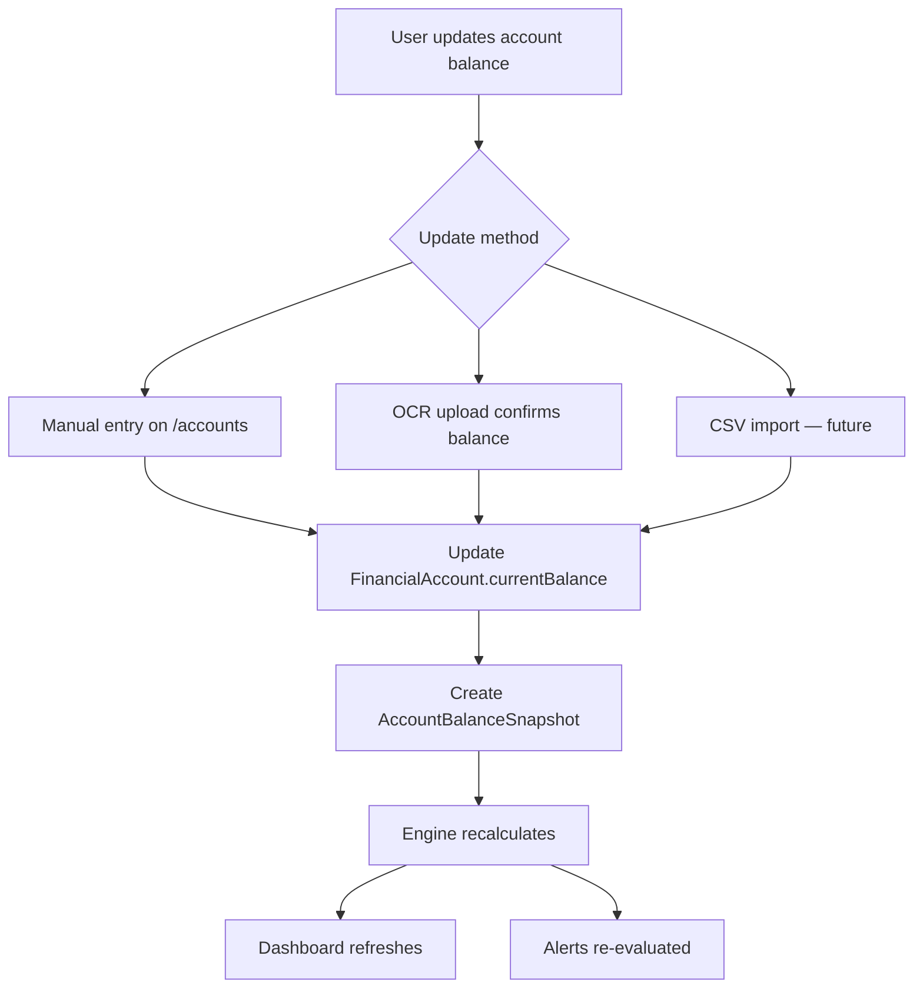

# Finance King — User Flows

Mermaid flowcharts for core user journeys. All flows assume navy/gold themed UI with risk color coding (GREEN → RED).

---

## 1. Authentication & First Visit

```mermaid
flowchart TD
    A[Visit financeking.app] --> B{Authenticated?}
    B -->|No| C[Landing Page /]
    C --> D{Has account?}
    D -->|No| E[/register]
    D -->|Yes| F[/login]
    E --> G[Create email + password]
    G --> H[Auto sign-in]
    F --> I[Enter credentials]
    I --> J{Valid?}
    J -->|No| K[Show error]
    K --> F
    J -->|Yes| L{onboardingComplete?}
    B -->|Yes| L
    L -->|No| M[/onboarding]
    L -->|Yes| N[/dashboard]
    H --> M
```

**Middleware rules:**
- Unauthenticated users on protected paths → redirect to `/login?callbackUrl=...`
- Authenticated users on `/login` or `/register` → redirect to `/dashboard`

---

## 2. Onboarding Wizard

Five-step wizard to configure financial topology before first dashboard view.



### 2.1 Onboarding Step 3 Detail (Income & Routing)

This is the most complex step. See wireframe: [`wireframes/onboarding-step3.md`](./wireframes/onboarding-step3.md).



---

## 3. Dashboard Daily Use

```mermaid
flowchart TD
    LOGIN[User opens app] --> DASH[/dashboard]
    DASH --> LOAD[Server: getEngineSnapshot + buildDashboardSnapshot]
    LOAD --> RENDER[Render KPI cards]
    
    RENDER --> STS[Safe to Spend — TODAY<br/>Gold monospace hero]
    RENDER --> HORIZONS[Week / Month / Payday horizons]
    RENDER --> RESERVES[Protected: Emergency $40k | Tax $30k]
    RENDER --> RISK[7-Day Risk Strip]
    RENDER --> SCENARIOS[Scenario cards: Base vs Strong+ESOP]
    
    STS --> PROV{isProvisional?}
    PROV -->|Yes| WARN[⚠ Provisional badge<br/>provisional_income, bill_due_dates]
    PROV -->|No| CLEAR[✓ Confident number]
    
    RENDER --> ACTIONS{User action}
    ACTIONS --> CAL[/calendar]
    ACTIONS --> UPLOAD[/upload]
    ACTIONS --> CREDIT[/credit]
    ACTIONS --> SIM[Simulate Purchase modal]
    ACTIONS --> ACCT[/accounts]
    
    RENDER --> ALERTS{Unread alerts?}
    ALERTS -->|Yes| ALERT_MODAL[Amex Payment Due warning]
    ALERTS -->|No| DONE[Continue browsing]
```

---

## 4. Statement Upload & OCR Review

```mermaid
flowchart TD
    START[User navigates to /upload] --> CHOOSE{Upload method}
    CHOOSE --> DRAG[Drag & drop PDF/image]
    CHOOSE --> CAMERA[Camera capture — mobile]
    
    DRAG --> VALIDATE{Valid file?}
    CAMERA --> VALIDATE
    VALIDATE -->|Too large| ERR_SIZE[Error: max 10MB]
    VALIDATE -->|Invalid type| ERR_TYPE[Error: PDF/PNG/JPG only]
    VALIDATE -->|OK| HASH[Compute file hash]
    
    HASH --> DUP{Duplicate hash?}
    DUP -->|Yes| DUP_MSG[Status: DUPLICATE<br/>Show previous upload]
    DUP -->|No| PRESIGN[POST /api/uploads/presign]
    
    PRESIGN --> S3[Client PUT to S3/MinIO]
    S3 --> QUEUE[Enqueue OCR job — BullMQ]
    QUEUE --> STATUS_P[Status: PROCESSING]
    
    STATUS_P --> WORKER[Worker: Tesseract OCR]
    WORKER --> EXTRACT[Parse transactions + balances]
    EXTRACT --> FAIL{Success?}
    
    FAIL -->|No| STATUS_F[Status: FAILED<br/>Retry option]
    FAIL -->|Yes| STATUS_R[Status: REVIEW_REQUIRED]
    
    STATUS_R --> REVIEW[/upload/review/:id]
    REVIEW --> SHOW[Show extracted fields + confidence scores]
    SHOW --> EDIT[User edits incorrect fields]
    EDIT --> DECIDE{Confirm?}
    
    DECIDE -->|Reject| REJECT[Status: REJECTED]
    DECIDE -->|Confirm| CONFIRM[Status: CONFIRMED]
    CONFIRM --> TXN[Create Transaction records]
    TXN --> SNAP[Create AccountBalanceSnapshot]
    SNAP --> REFRESH[Dashboard recalculates safe-to-spend]
```

See wireframe: [`wireframes/upload-review.md`](./wireframes/upload-review.md).

---

## 5. Purchase Impact Simulation



**Example:** Monterey Car Week ($2,500) from PenFed Checking — engine checks if $15k Amex payment still fundable.

---

## 6. Amex Payoff Flow



---

## 7. Scenario Comparison



---

## 8. Calendar Day Detail



See wireframe: [`wireframes/calendar-day-detail.md`](./wireframes/calendar-day-detail.md).

---

## 9. Alert Lifecycle



---

## 10. Account Balance Update



---

## Related Documents

- [PRD](./PRD.md) — Feature requirements
- [Pages & Components](./pages-and-components.md) — Route inventory
- [Wireframes](./wireframes/) — ASCII UI mockups
- [OCR Ingestion](./ocr-ingestion.md) — Upload pipeline details
